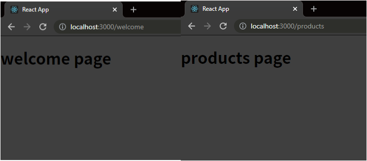
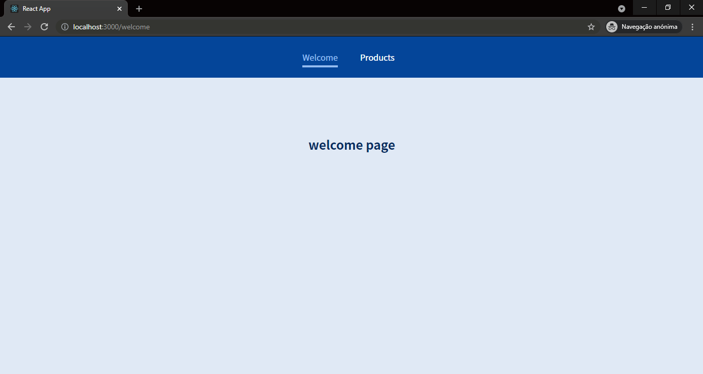
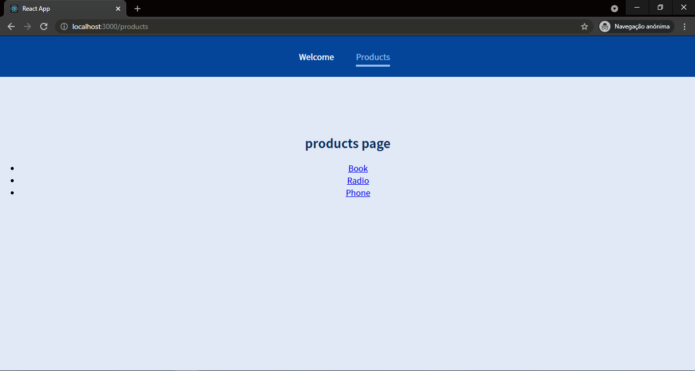
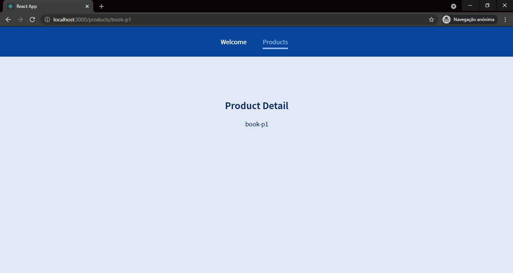

# Intro to React-Router

-------------------------------

## Test Project 1:


#### A super simple example, made like this:

```javascript
import { Route } from 'react-router-dom';
import Welcome from './pages/Welcome';
import Products from './pages/Products';

function App() {
  return (
    <div>
      <MainHeader/>
      <main>
        <Route path="/welcome">
          <Welcome />
        </Route>
        <Route path="/products">
          <Products />
        </Route>
      </main>
    </div>
  );
}

export default App;
```

-------------------------------

## Test Project 2:

-------------------------------




-------------------------------

This one is a bit more detailed and I use more **react-router** features such as:

* Route
* Switch
* Redirect
* Link / Navlink
* useParams

-------------------------------